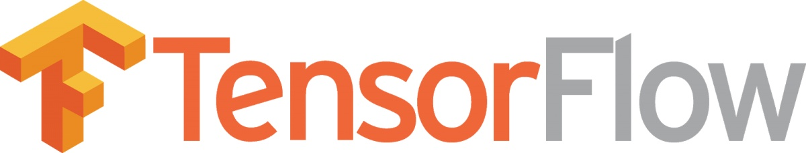

## 深度学习框架
---

### 一、什么是深度学习
`深度学习`（DL, Deep Learning）是`机器学习`（ML, Machine Learning）领域中一个新的研究方向。

深度学习是学习样本数据的`内在规律`和`表示层次`，这些学习过程中获得的信息对诸如文字，图像和声音等数据的解释有很大的帮助。它的最终目标是让机器能够像人一样具有分析学习能力，能够识别文字、图像和声音等数据。 深度学习是一个复杂的机器学习算法，在语音和图像识别方面取得的效果，远远超过先前相关技术。

深度神经网络中的"深层"通常指的是具有多个隐藏层的网络。在这里，隐藏层是指除输入层和输出层之外的所有层。如果一个神经网络只包括一个或两个隐藏层，通常不被认为是深度神经网络。然而，一旦网络包括三个或更多隐藏层，它就可以被称为深度神经网络。深度神经网络的深度是相对的，它不是一个固定的数字，而是根据任务和模型的需求而变化的。一些经典的深度神经网络架构，如深度信念网络（Deep Belief Networks）和卷积神经网络（Convolutional Neural Networks）。深度神经网络由多个隐藏层组成，能够自动提取输入数据的特征，并学习到数据之间的复杂关系。神经网络的层次可以分为单层神经网络、多层神经网络和深度学习。单层神经网络只包含一个隐藏层，它只能处理线性可分的问题，无法处理复杂的非线性分类问题。多层神经网络包含两个或多个隐藏层，通过多层次的连接和权重调整，可以对数据进行更加复杂的特征提取和处理，提高神经网络的分类和回归能力。深度学习是神经网络的一种特殊形式，它通过采用特定的优化算法和结构设计，使得神经网络能够自动进行特征提取和分类，避免了手工设计特征的麻烦，提高了神经网络的学习能力和效果。

深度学习在`搜索技术`，`数据挖掘`，`机器学习`，`机器翻译`，`自然语言处理`，`多媒体学习`，`语音`，`推荐和个性化技术`，以及其他相关领域都取得了很多成果。深度学习使机器模仿视听和思考等人类的活动，解决了很多复杂的模式识别难题，使得人工智能相关技术取得了很大进步。

深度学习是一类`模式分析`方法的统称，就具体研究内容而言，主要涉及三类方法：
- 基于卷积运算的神经网络系统——卷积神经网络`CNN`
- 基于多层神经元的自编码神经网络，包括`自编码`以及近年来受到广泛关注的`稀疏编码`两类
- 以多层自编码神经网络的方式进行预训练，进而结合鉴别信息进一步优化神经网络权值的`深度置信网络DBN`

<br>
<br>

### 二、深度学习框架
#### 2.1、概述
在深度学习初始阶段，每个深度学习研究者都需要写大量的重复代码。为了提高工作效率，这些研究者就将这些代码写成了一个框架放到网上让所有研究者一起使用。接着，网上就出现了不同的框架。全世界最为流行的深度学习框架有[Tensorflow](https://www.tensorflow.org/)、[keras](https://keras.io/)、[Caffe](http://caffe.berkeleyvision.org/)、[Caffe2](https://caffe2.ai/)、[CNTK](https://www.microsoft.com/en-us/cognitive-toolkit/)、[PyTorch](http://pytorch.org/)、[Torch](http://torch.ch/)、[deeplearning4j](https://deeplearning4j.org/)和[Theano](http://www.deeplearning.net/software/theano/)和[incubator-mxnet](http://mxnet.incubator.apache.org/)。

在开始深度学习项目之前，选择一个合适的框架是十分重要的，因为一个合适的框架能起到事半功倍的作用，接下来对一些常用的深度学习框架进行介绍。

---

#### 2.2、Tensorflow



Tensorflow最初由谷歌大脑团队开发，用于Google的研究和生产，于2015年11月9日在`Apache 2.0`开源许可下发布。

##### 应用
谷歌的Tensorflow可以说是目前最受欢迎的深度学习主流框架。[Gmail](https://mail.google.com/)、[Uber](https://www.uber.com/)、[Aribnb](https://www.airbnb.cn/)、[Nvidia](https://www.nvidia.cn/)以及许多其他知名品牌都在使用Tensorflow框架。

##### 特性
- Tensorflow提供了一个Python API，以及C++、Haskell、Java、Go和Rust API，第三方包可以用于Ｃ#、.NET Core、Julia、R和Scala。
- 底层核心引擎由C++实现，通过gRPC实现网络互访、分布式执行。虽然它的Python/C++/Java API共享了大部分执行代码，但是有关于[反向传播](https://zh.wikipedia.org/wiki/%E5%8F%8D%E5%90%91%E4%BC%A0%E6%92%AD%E7%AE%97%E6%B3%95)梯度计算的部分需要在不同语言单独实现。当前只有Python API较为丰富的实现了反向传播部分。所以大多数人使用Python进行模型训练，但是可以选择使用其它语言进行线上推理。
- Tensorflow在Windows和Linux上支持使用Bazel或CMake构建，在某些平台上也支持直接使用GNU make进行编译。
- 拥有强大的计算集群，还可以在iOS和Android等移动平台上运行模型。
- 使用静态计算图进行操作，需要先定义图形，然后运行计算过程。如果需要对架构进行修改，需要重新训练模型。
- Tensorflow的灵活的架构可以使研究员在不重写代码的情况下将计算部署到桌面，服务器或移动设备中的一个或多个CPU或GPU。
- 包括数据可视化工具包[TensorBoard](https://www.tensorflow.org/tensorboard)

但是Tensorflow编程入门难度比较大，初学者需要仔细研究神经网络的架构，并且正确评估输入和输出数据的纬度和数量。

##### 示例

Hello World
```sh
import tensorflow as tf
hw = tf.constant("Hello World")
with tf.Session() as sess:
    print(sess.run(hw)) 
```

两矩阵相乘
```sh
import tensorflow as tf

# 构建数据流图.
c = tf.constant([[1.0, 2.0], [3.0, 4.0]])
d = tf.constant([[1.0, 1.0], [0.0, 1.0]])
e = tf.matmul(c, d)

# 创建一个Session来执行图的运算.
with tf.Session() as sess:
  # 计算图并存储结果，e代表结果.
  result = sess.run(e)

print(result)
```

使用`Feeding`在执行时传参：
```sh
import tensorflow as tf

c = tf.constant([[1.0, 2.0], [3.0, 4.0]])
d = tf.constant([[1.0, 1.0], [0.0, 1.0]])
e = tf.matmul(c, d)

sess = tf.Session()

# 使用Feeding在执行时传参
result = sess.run(e,feed_dict={c:[[0.0, 0.0], [3.0, 4.0]]})
print(result)
sess.close()
```

Tensorflow图中的节点是可以带状态的，以下展示Tensorflow中占位符的使用：
```sh
# 输入占位符
input_placeholder = tf.placeholder(tf.int32) 
sess = tf.Session() 
print (sess.run(input_placeholder, feed_dict={input_placeholder: 2}))
sess.close()
```

在Tensorflow中使用`get_variable()`创建变量。`get_variable()`中前两个参数是必须的，其余参数可选。第一个参数为`name`，是一个唯一标识这个变量对象的字符串，它必须相对于`全局图`是唯一的。所以一定要保证使用的`所有变量命名没有重复`。第二个参数是`shape`，是与张量形状对应的整数数组，按顺序每个纬度只有一个整数。创建标量，需要使用形状为 [] 的空列表。将值放入变量的方法有两种：`初始化器`和 `assign()`。初始化器应该把声明（`constant_initializer`）与执行初始化（`global_variables_initializer`）两种节点配合使用。
```sh
import tensorflow as tf

count_variable = tf.get_variable("count", [])
zero_node = tf.constant(0.)
assign_node = tf.assign(count_variable, zero_node)
sess = tf.Session()
sess.run(assign_node)
print (sess.run(count_variable))
 
const_init_node = tf.constant_initializer(0.)
count_variable1 = tf.get_variable("count1", [], initializer=const_init_node)
init = tf.global_variables_initializer()
sess.run(init)
print (sess.run(count_variable1))

sess.close()
```

通过以下方式使用带有状态的图
```sh
import tensorflow as tf

count = tf.Variable([0],trainable=False);
init_op = tf.global_variables_initializer()
update_count = count.assign_add(tf.constant([2]))

sess = tf.Session()
sess.run(init_op)

for step in range(10):
    result = sess.run(update_count)
    print("step %d: count = %g" % (step,result))

sess.close()
```

梯度计算
```sh
# 1.txt文件中的内容如下：
# 3
# 1
# 4
# 2

import tensorflow as tf

filename_queue = tf.train.string_input_producer(['1.txt'],num_epochs=1)
reader = tf.TextLineReader()
key,value = reader.read(filename_queue)
num = tf.decode_csv(value,record_defaults=[[0]])
x = tf.Variable([0])
loss = x * num
grads = tf.gradients([loss],x)
grad_x = grads[0]

def train_fn(sess):
  train_fn.counter += 1
  result = sess.run(grad_x)
  print("step %d: grad = %g" % (train_fn.counter,result))

train_fn.counter = 0

sv = tf.train.Supervisor()
tf.train.basic_train_loop(sv,train_fn)

# 结果输出如下
# step 1: grad = 3
# step 2: grad = 1
# step 3: grad = 4
# step 4: grad = 2
```

整体来说，因为Tensorflow由Google支持，所以框架短期内不会被抛弃，且发展前景十分好，因此值得投入时间对该框架进行学习。

---

#### 2.3、Keras


Keras是一个用Python编写的开源神经网络库，能够在`TensorFlow`、`Microsoft Cognitive Toolkit`、`Theano`或`PlaidML`之上运行。

Keras旨在快速实现深度神经网络，专注于用户友好、模块化和可扩展性，是ONEIROS（`开放式神经电子智能机器人操作系统`）项目研究工作的部分产物，主要作者和维护者是Google工程师弗朗索瓦·肖莱。

2017年，TensorFlow核心库开始支持Keras。自CNTK v2.0开始，微软也想Keras添加了CNTK后端。

Keras被认为是一个接口（API），而非独立的机器学习框架。它提供了更高级别、更直观的抽象集，无论使用何种计算后端，用户都可以轻松地开发深度学习模型。

##### 特征

- Keras包含许多常用神经网络构建块的实现，例如`层`、`目标`、`激活函数`、`优化器`和`一系列工具`，可以更轻松地处理图像和文本数据。
- 除标准神经网络外，Keras还支持`卷积神经网络`（CNN）和`循环神经网络`（RNN），或者二者的结合。其他常见的实用公共层支持有`Dropout`、`批量归一化`和`池化层`等。
- Keras允许用户在iOS和Android操作系统的`智能手机`、`网页`或`Java虚拟机`上制作深度模型，还允许在图形处理器和张量处理器的集群上使用深度学习模型的分布式训练。
- Keras的代码可读性强，作为一个简洁的API，它具有高度的模块化和可扩展特性，能够帮助研究员快速地创建应用程序。
- Keras模型中的`序列化`和`反序列化`API，回调和使用Python生成器的数据流非常成熟
- 支持无缝的CPU和GPU的切换

对于刚刚入门的人来说，Keras是最好的深度学习框架。 它是学习和原型化简单概念的理想选择，可以理解各种模型和学习过程的本质。

##### 和Tensorflow的对比
Tensorflow和MXNet、PyTorch等框架都属于底层框架，可以实现广义矩阵-矩阵乘法和卷积运算的神经网络原语之类的数学运算。

而Keras则属于高度集成框架，虽然更容易创建模型，但是面对复杂的网络架构时效果较差。

---
#### 2.4、Caffe


Caffe（`Convolutional Architecture for Fast Feature Embedding`）是一个以表达式、速度和模块化为核心的，由贾扬清在加州大学伯克利分校攻读博士期间创建，是一个清晰、可读性高、快速的深度学习框架。在`BSD`许可下开源，使用C++编写，带有Python接口。

##### 应用
Caffe应用于学术研究项目、初创原型甚至视觉、语音和多媒体领域的大规模工业应用。

雅虎还将Caffe与[Apache Spark](https://spark.apache.org/)集成在一起，创建了一个分布式深度学习框架[CaffeOnSpark](https://databricks.com/session/caffeonspark-deep-learning-on-spark-cluster)。

##### 特征

- Caffe从开始的设计就尽可能模块化，允许对新的数据格式、网络层和损失函数进行扩展。
- Caffe的模型(model)定义是用`ProtocolBuffer`语言写进配置文件的，Caffe会根据网络的需要来正确占用内存。
- Caffe是纯粹的C++/CUDA架构，支持命令行、Python和Matlab接口。
- 面向图像分类和图像分割，还支持CNN、RCNN、LSTM和全连接神经网络的设计。
- 支持基于GPU和CPU的加速计算内核库，如NVIDIA cuDNN和Intel MKL。
- 模型及优化是通过配置定义的，而不是使用硬编码的方式，可以通过一个函数调用实现CPU和GPU的无缝切换。可以用GPU训练，然后部署到集群或者移动设备上。
- Caffe在单个的Nvidia K40 GPU上每天能够处理6千万张图片。识别速度为1ms/张，训练时速度为4ms/张。
- 在Caffe中，每一个单一的模块都对应一个测试。


Caffe的清晰性表现在网络结构与参数都独立于代码，用户按照遵循一定的简单格式编写普通文本，就能够定义自己的神经网络，并且按照自己的需要进行修改调整。而高效性则体现在对CUDA的支持。

##### 架构

数据存储：

Caffe通过`blobs`即以4维数组的方式存储和传递数据。Blobs提供了一个统一的内存接口，用于批量图像（或其它数据）的操作，参数或参数更新。Models是以Google Protocol Buffers的方式存储在磁盘上。大型数据存储在LevelDB数据库中。

层：

一个Caffe`层`(Layer)是一个神经网络层的本质，它采用一个或多个blobs作为输入，并产生一个或多个blobs作为输出。网络作为一个整体的操作，层有两个关键职责：前向传播，需要输入并产生输出；反向传播，取梯度作为输出，通过参数和输入计算梯度。Caffe提供了一套完整的层类型。

网络和运行方式：

Caffe保留所有的有向无环层图，确保正确的进行前向传播和反向传播。Caffe模型是终端到终端的机器学习系统。一个典型的网络开始于数据层，结束于loss层。通过一个单一的开关，使其网络运行在CPU或GPU上。在CPU或GPU上，层会产生相同的结果。

训练一个网络：

Caffe训练一个模型(Model)靠快速、标准的随机梯度下降算法。在Caffe中，微调(Fine tuning)，是一个标准的方法，它适应于存在的模型、新的架构或数据。对于新任务，Caffe 微调旧的模型权重并按照需要初始化新的权重。

---
#### 2.5、Caffe2


Caffe2由Facebook于2017年推出，是一个轻量级，模块化，可扩展的深度学习框架。在原来的Caffe的基础上，Caffe2的设计思想是表达，速度和模块化。在强调轻便性的同时，也保持了可扩展性和计算性能。

##### 应用
ImageNet训练基准使用了64块最新的英伟达GPU和ResNet-50神经网络架构。Facebook 工程师实现的Caffe2的[data_parallel_model](https://github.com/caffe2/caffe2/blob/master/caffe2/python/data_parallel_model.py)能够在 Facebook 的 8 个Big Basin人工智能服务器（每个服务器配有 8 个英伟达 Tesla P100 GPU 加速器，8 个服务器共有 64 块 GPU）上进行分布式神经网络训练。这写系统的扩展结果显示使用Caffe2框架带来了近乎直线的深度学习训练扩展以及57倍的吞吐量加速。

##### 特性
- Caffe2支持Caffe转Caffe2模型。
- Caffe2框架可以通过一台机器上的多个GPU或具有一个及多个GPU的多台机器来进行分布式训练。
- 可以在iOS系统、Android系统和树莓派（Raspberry Pi）上训练和部署模型。
- 可用简单的代码调用Caffe2中预先训练好的Model Zoo模型。
- Caffe2框架已经应用在Facebook平台上，通过在内部用于各种深度学习和增强现实任务，Caffe2在Facebook对于规模和性能的需求上得到了锻造。
- NVIDIA（英伟达），Qualcomm（高通），Intel（英特尔），Amazon（亚马逊）和Microsoft（微软）等公司的云平台都已支持Caffe2。

Caffe2从一开始就以性能、扩展、移动端部署作为主要设计目标。Caffe2的核心C++库能提供速度和便携性，而其Python和C++ API则可以轻松地在Linux、Windows、iOS、Android甚至Raspberry Pi和NVIDIA Tegra上进行原型设计、训练和部署。

在Facebook和英伟达的合作下，Caffe2已经可以充分利用英伟达GPU深度学习平台。Caffe2可使用最新的英伟达深度学习SDK库——cuDNN、cuBLAS和NCCL——来实现高性能、多GPU加速训练和推理。

绝大多数内置函数都可根据运行状态在 CPU 模式和 GPU 模式之间无缝切换。这意味着无需额外编程即可享用深度学习超级加速的便利。这引出了 Caffe2 激动人心的另一个方面：多 GPU 和多主机处理。Caffe2 使并行化网络训练变得简单，现在实验和扩展对你而言也非常简单。

##### 新功能
- CNN分布式训练可由单个计算图表征，不管是在一个或多个GPU还是在多台机器上训练。这对Facebook规模的深度学习应用很关键。

- 在专业硬件上轻松进行异构计算。例如，在iOS上，Caffe2计算图可从CPU获取图像，将其转化为Metal GPU缓存对象，并将计算完全保留在GPU上，以获得最大吞吐量。

- 更好地管理运行时间资源，比如使用memonger优化静态内存，或者预打包训练网络以获得最佳性能。

- float、float16、int8 混合精度和其他量化模型的计算。


Caffe2有超过400个算子，通过浏览[算子目录](http://caffe2.ai/docs/operators-catalogue.html)以及[稀疏操作](http://caffe2.ai/docs/sparse-operations.html)，可以尝试编写[自定义算子](http://caffe2.ai/docs/custom-operators.html)

---
#### 2.5、PyTorch


PyTorch是一个开源的Python机器学习库，基于Torch，底层由C++实现，应用于自然语言处理等人工智能领域。框架最初是由Facebook的人工智能研究团队开发，被[Twitter](https://twitter.com/)、[Salesforce](https://www.salesforce.com/cn/?ir=1)等公司使用。PyTorch目前被用于Uber的概率编程软件Pyro.

PyTorch不是Python绑定到一个单一的C++框架，它被构建为深度Python的集成。

##### 特性
- 与Tensorflow框架不同，PyTorch库使用动态更新的图形进行操作，可以在流程中更改体系结构
- 可以使用pdb或者PyCharm等标准调试器
- 使用类似于Numpy的张量计算，可以使用GPU加速
- 基于带地总微分系统的深度神经网络
- 包括torch.nn、torch.optim等子模块

PyTorch训练神经网络的过程简单明了，支持数据并行和分布式学习模型，并且还包含了许多预先训练的模型，十分适合小型项目和原型设计。

---
#### 2.6、Torch


Torch是一个基于BSD License的开源的机器学习的框架，早在2002年就发布了Torch的初版。Torch是Torch7中的主要软件包，其中定义了多维张量的数据结构和数学运算。 此外，它提供了许多用于访问文件的实用程序，序列化任意类型的对象和其他有用的实用程序。Torch是一个科学的计算框架，广泛支持GPU首先使用的机器学习算法，一直聚焦于大规模的机器学习应用，尤其是图像或者视频应用等领域。

##### 特性
- 强大的N维数组操作的支持
- 提供很多对于索引/切片等的常用操作
- 常见线性代数计算的支持
- 神经网络和基于能量的模型
- 支持GPU计算
- 可嵌入，可移植到iOS或者Android


Torch的目标在于保证使用的方式简单的基础上最大化地保证算法的灵活性和速度。核心是流行的神经网络和简单易用的优化库，使用Torch能在实现复杂的神经网络结构的时候保证最大的灵活性，同时可以使用并行的方式对CPU和GPU进行高效的操作。

##### Torch和Lua
Torch选择了LuaJIT作为实现的语言之一，原因在于LuaJIT具有以下优势：
- 快速，并且拥有一个透明的JIT编译器
- 像Python一样简单而且可读
- 和C语言的接口非常干净和简单
- 可嵌入到任何环境中，比如iphone的引用，视频游戏或者web后端等

因为简单快捷的脚本语言LuaJIT以及基础的C/CUDA实现，Torch使用起来效率很高，但是对于多数刚入门的研究员来说，C语言的编程难度相对较大，同时也需要花费时间学习Lua语言。

[Lua快速入门指南](https://www.runoob.com/lua/lua-tutorial.html)


---
#### 2.7、CNTK


微软认知工具包（Microsoft Cognitive Toolkit）前称CNTK，是一个由微软研究院开发的深度学习框架。Microsoft Cognitive Toolkit通过有向图将神经网络变化为一系列计算步骤。

CNTK提供Python，C＃或C ++接口，也可以通过自己的模型描述语言（BrainScript）作为独立的机器学习工具使用。 另外，可以使用Java程序中的CNTK模型评估功能。

